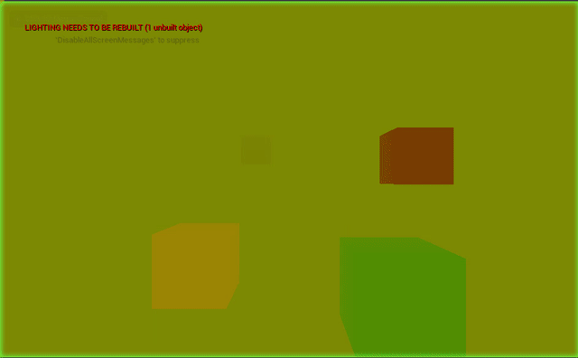
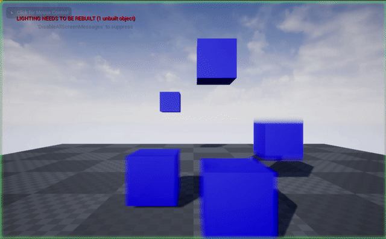

# VelocityUE4

Developed with Unreal Engine 4.24. Tries to reproduce Velocity Buffer inconsistencies for dynamic objects, related to this [PR](https://github.com/EpicGames/UnrealEngine/pull/6933).

## Approach

Contains custom post process material, that equivalently to the built-in "Velocity" matrial outputs u-velocity in the Green channel, and v-velocity in the Red channel. For debug purposes this has been scaled. First results seem to suggest that dynamic objects are correctly captured:

 
