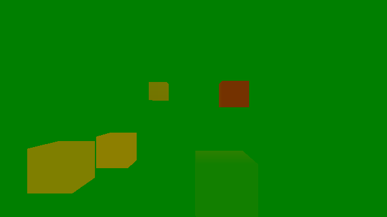
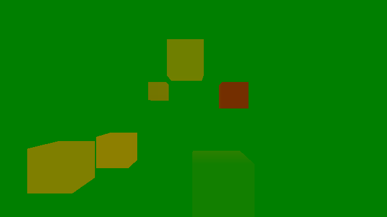
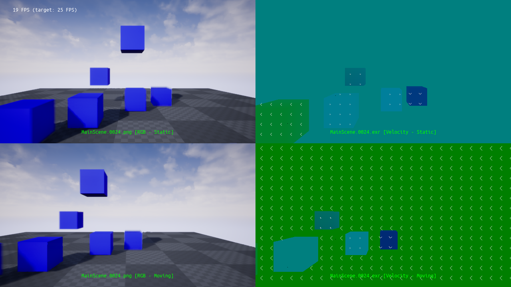

# VelocityUE4 - Bug Report

**ISSUE**: the built-in velocity buffer for UE4 does not provide consistent outputs for static and dynamic objects.

## Version and System

Working on UE4.24 Ubuntu 20.04 (unpatched locally built tag "4.24"). (Please note that according to this [PR](https://github.com/EpicGames/UnrealEngine/pull/6933) the bug persists also on the current version of UE4.25)

## Background

We would like to output optical flow, i.e. the velocity buffer frame-by-frame containing pixel velocities. Some inconsistencies have already been reported in this [PR](https://github.com/EpicGames/UnrealEngine/pull/6933). This pull request seems to fix the velocities for static objects (moving camera), but is not coherent with outputs on dynamic objects. We need to have the same scale and consistent outputs for both types of objects.

## Approach

In the attached UE4 project we implemented a simple sample scene with a moving camera actor and some static and movable cubes. A custom post process material is applied, that equivalently to the built-in "Velocity" material outputs u-velocity in the Green channel, and v-velocity in the Red channel. For debug purposes the output has been scaled.

## STEPS TO REPRODUCE:

1. Open in the project MainScene, and MainLevelSequence
1. Render the content by clicking on the movie slate (PNG frame-by-frame output is fine)
1. Change Cube2's "Mobility" property to "Movable"
1. Re-render the sequence

## Observed failure

The cube (top middle, moving left-wards)) is not visible when set to "static" (in the first few frames).

**Expected behavior**: Ego-motion induced velocity is calculated correctly also on static objects.

**Observed behavior**: "Movable" object is rendered differently although, the scene (i.e. model positions and velocities) remains exactly the same.

**General issue**: even if we fix camera-motion induced velocities on static objects (as this [pull request](https://github.com/EpicGames/UnrealEngine/pull/6933) suggests) we need to get the _same_ units as on dynamic objects, in order to have a full coherent velocity buffer (required in our use case).

## Results

See below frame 0005, the first with object mobility set to static, where the static cube on top (moving to the left) is not visible. In the same frame with the object mobility set to "movable", the cube appears. The optical flow however, should be approximately be the same as the background optical flow, which is way too high.

**note the missing cube in the upper frame (scene model has NOT been changed)**

### More elaborated output

In a more involved experiment, switching on and off the camera movement and plotting the velocity buffer with vectors makes clear that the magnitude of the static scene velocity is too large when the camera is moving (see second row on the right, where the whole image becomes green with too large vectors). Also here the static cube is not visible. A dynamic cube with the same velocity as the camera (bottom left) on the other hand correctly shows zero optical flow. This means that for dynamic objects, camera induced optical flow seems to be correctly weighted against the object's velocity for _movable_ objects.

 

